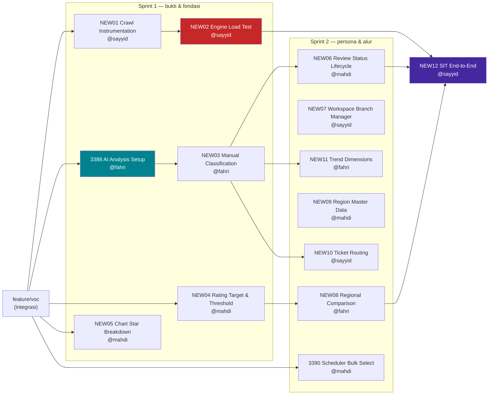

# Grooming VoC — Pembagian Kerja 3 Dev

Turunan dari [[2026-08-21-voc-progress-review]]. Semua kode Jira `DNGO19-NEWxx`
di dokumen ini adalah **placeholder** — nomor sebenarnya digenerate Jira saat
tiketnya dibuat. Ganti seluruh kemunculannya sekali jadi, jangan sebagian.

---

## Aturan branch — baca dulu sebelum mulai

> [!danger] `feature/DNGO19-3387_VOC-Review-Manage-Actions` DIBEKUKAN
> Branch itu sedang naik ke **QA lalu release**. **Jangan commit apa pun ke sana**,
> termasuk perbaikan kecil yang "sekalian".
>
> Masalahnya: **empat pekerjaan baru dari notulen jatuh persis di wilayahnya** —
> status open/close, klasifikasi manual, widget belum-review, dan penerbitan
> tiket. Semuanya menyentuh `reviews.volt` dan `reviewManageAction`.
>
> Keempatnya sudah dipecah ke branch tersendiri di bawah (`NEW03`, `NEW06`,
> `NEW10`). Kalau ada temuan lain yang menyentuh area itu, **buat branch baru
> lagi** — jangan menumpang.

| Aturan | Isi |
|---|---|
| Base branch | `feature/voc` — semua branch baru dicabang dari sini |
| Target PR | balik ke `feature/voc`, bukan langsung `develop` |
| Penamaan | `feature/DNGO19-<kode>_VOC-<Nama-Singkat-Inggris>` |
| Scope creep | **Boleh bikin branch baru.** Jangan menyelundupkan scope baru ke branch berjalan — itu yang bikin PR jadi tidak bisa di-review |
| Sinkronisasi | Tarik `feature/voc` minimal 1× sehari; konflik kecil tiap hari jauh lebih murah daripada konflik besar di akhir |
| Migrasi | Nomor versi migrasi **diambil saat mau commit**, bukan saat mulai — kalau tidak, dua orang akan memakai nomor yang sama |

---

## Tim & cara membagi

| Dev        | SoW                                                                                      |
| ---------- | ---------------------------------------------------------------------------------------- |
| **Sayyid** | ambiguitas tinggi, risiko sistemik, butuh konteks lintas repo (OneBox ↔ Crawler)         |
| **Fahri**  | vertikal AI/analisa , AI Analysis  plus turunan analitiknya                              |
| **Mahdi**  | spesifikasinya tajam, batas jelas, kriteria terima bisa diperiksa sendiri tanpa bertanya |

### Pemakaian AI 

Estimasi di dokumen ini **sudah mengasumsikan AI dipakai penuh**. Yang perlu
disepakati: AI dipakai untuk mempercepat bagian yang bisa diverifikasi, bukan
untuk menghasilkan sesuatu yang tidak dimengerti penulisnya.

- **Dipakai bebas:** boilerplate migrasi, query SQL, transformasi data untuk
  chart, penulisan test, membaca kode lama yang panjang, draft dokumentasi.
- **Wajib diverifikasi manual:** apa pun yang menyentuh SQL agregasi, gerbang
  izin, dan kontrak API Crawler. Sudah terbukti sekali di modul ini bahwa cacat
  yang lolos bukan cacat sintaks, melainkan cacat asumsi — dan AI tidak
  menangkapnya.
- **Aturan pengaman:** kalau tidak bisa menjelaskan kenapa sebuah baris ada saat
  ditanya di PR, baris itu belum siap di-merge.

---

## Peta branch

Dua simpul yang menahan paling banyak:

- **`NEW03` Manual Classification** menahan tiga branch (`NEW06`, `NEW10`, `NEW11`).
  Kalau ini telat, separuh Sprint 2 ikut telat.
- **`NEW02` Engine Load Test** tidak menahan branch lain, tetapi menahan
  **keputusan arsitektur**. Kalau hasilnya buruk, sebagian rencana berubah.

---

## Sprint 1 — minggu ini (25–29 Agustus)

Tujuan sprint: **punya bukti**, bukan punya fitur. Akhir minggu harus bisa
menjawab dua pertanyaan Pak — "engine-nya kuat berapa?" dan "masalah Hermina
apa?" — dengan angka, bukan pendapat.

---

###  VOC-Crawl-Instrumentation · **@sayyid**

`feature/DNGO19-CODE_VOC-Crawl-Instrumentation`

**Uji beban tanpa instrumentasi menghasilkan cerita, bukan
data. Di sesi 21 Agu, pertanyaan *"berapa lama?"* tidak bisa dijawab 

**Scope**

- Catat per batch crawl: **waktu mulai, waktu selesai, durasi**, jumlah disisir,
  jumlah cocok, jumlah tersimpan.
- Tandai **sumber batch**: `manual` vs `scheduler`. Sekarang tercampur dan
  pemiliknya sendiri mengakui tidak bisa membedakan.
- **Snapshot rating platform** pada saat crawl, disimpan apa adanya. Jangan
  dihitung ulang dari sampel — rating Google dihitung sejak bisnis berdiri,
  hitungan sendiri akan berbeda dan itu akan terlihat seperti bug.
- Tampilkan durasi dan sumber di kolom Riwayat Fetch.

**Di luar scope:** perubahan tampilan Riwayat Fetch selain dua kolom itu.

**Kriteria terima**

- [ ] Setiap batch punya `started_at`, `finished_at`, `duration_seconds` terisi — termasuk batch yang gagal
- [ ] Kolom sumber menampilkan `Manual` / `Terjadwal` dan bisa disaring
- [ ] Rating platform saat crawl tersimpan dan berbeda field dari rating hitungan sendiri
- [ ] Batch yang berjalan menampilkan durasi berjalan, bukan kosong

**Risiko:** batch yang mati di tengah tidak pernah menulis `finished_at` →
durasinya kosong selamanya. Tentukan perlakuannya di depan, jangan ditemukan
belakangan.

**AI:** bagus untuk migrasi kolom dan transformasi tampilan. Verifikasi manual
bagian penyimpanan snapshot rating — salah field di sini menghasilkan angka yang
salah tapi masuk akal, dan itu jenis yang paling lama tidak ketahuan.

**Estimasi:** 1,5 hari

---

### `NEW02` · VOC-Engine-Load-Test · **@sayyid**

`feature/DNGO19-NEW02_VOC-Engine-Load-Test`
**Tergantung:** `NEW01`

> [!danger] Ini item berisiko tertinggi di seluruh backlog
> Bukan karena sulit dikerjakan, tapi karena **kalau jawabannya buruk, bukan satu
> fitur yang gagal — seluruh produk berhenti.** Beban yang pernah dicoba baru
> 20–50. Target Hermina saja 80 cabang × 3× sehari = **240 crawl/hari**. Skenario
> Pertamina (semua SPBU) jauh di atas itu.
>
> Karena ketidakpastiannya besar, ia dijawab **sekarang** — selagi mengubah arah
> masih murah.

**Scope**

- Jalankan beban bertingkat: 20 → 50 → 80 cabang, 1× lalu 3× sehari.
- Catat untuk tiap tingkat: durasi total, durasi per cabang, tingkat keberhasilan,
  bentuk kegagalan.
- Uji **strategi anti-blokir** minimal dua varian: satu akun/satu Chrome vs
  disebar (container/profil terpisah).
- Keluaran wajib: **dokumen hasil**, bukan cuma "sudah dicoba" — angka, grafik
  sederhana, dan rekomendasi.

**Kriteria terima**

- [ ] Ada tabel hasil per tingkat beban dengan angka nyata
- [ ] Titik jenuh teridentifikasi: pada beban berapa mulai gagal, dan gagalnya seperti apa
- [ ] Ada rekomendasi tertulis soal strategi akun/Chrome/container, dengan alasannya
- [ ] Kalau ditemukan pemblokiran Google, gejalanya didokumentasikan (kode, pesan, berapa lama)

**Koordinasi:** @bang-sam untuk sisi Crawler dan akun Google.

**AI:** bagus untuk menyusun skrip uji dan meringkas log jadi tabel. **Jangan**
pakai AI untuk menyimpulkan penyebab kegagalan tanpa membaca log aslinya.

**Estimasi:** 2 hari (mayoritas waktu tunggu — jalankan paralel dengan `NEW01`
setelah instrumentasinya jadi)

---

### `3388` · VOC-AI-Analysis-Setup · **@fahri**

`feature/DNGO19-3388_VOC-AI-Analysis-Setup` *(branch sudah ada)*

**Kenapa ini simpul.** Tiga branch lain menunggu keluarannya. Trend per kategori,
tiket ke unit, dan briefing manajemen semuanya bercabang dari satu kemampuan:
**tahu review ini soal apa.** Sentimen positif/negatif tidak menjawab itu.

**Scope**

- Sambungkan tagging AI ke **master `Category` yang sudah ada** — hentikan mock
  data. Pak Agung menyebut kategorinya sudah dibuat, tinggal disambungkan;
  **konfirmasi dulu ke beliau** sebelum menulis kode.
- Simpan hasil klasifikasi dengan **penanda sumber**: hasil AI vs koreksi manusia.
- Sediakan kontrak data yang jelas untuk konsumen hilir (`NEW03`, `NEW06`, `NEW11`).

**Di luar scope:** UI klasifikasi manual (itu `NEW03`), widget hitungan (itu `NEW06`).

**Kriteria terima**

- [ ] Kategori berasal dari master `Category`, bukan konstanta di kode
- [ ] Setiap review terklasifikasi menyimpan kategori + skor/keyakinan + penanda sumber
- [ ] Review yang tidak bisa diklasifikasi ditandai eksplisit, bukan dibiarkan kosong
- [ ] Kontrak datanya ditulis di markdown dan disepakati sebelum `NEW03` mulai

> [!warning] Kontrak dulu, baru kode
> `NEW03`, `NEW06`, dan `NEW11` semuanya membaca keluaran branch ini. Kalau
> kontraknya berubah di tengah, tiga branch ikut bongkar. Tulis kontraknya di
> hari pertama dan kunci.

**AI:** ini justru pekerjaan tentang AI. Yang perlu dijaga: **prompt dan
aturannya harus bisa dijelaskan dan diulang**, bukan hasil coba-coba yang
kebetulan bagus di 10 sampel.

**Estimasi:** 3 hari

---

### `NEW04` · VOC-Rating-Target-Threshold · **@mahdi**

`feature/DNGO19-NEW04_VOC-Rating-Target-Threshold`

**Warna merah di dashboard sekarang tidak punya dasar. 
menetapkan target rating **per company/site**, bukan konstanta.

**Scope**

- Setelan **target rating per site** (mis. Hermina 4,5) di Setup Parameter.
- Semua tampilan rating memakai ambang ini untuk pewarnaan: di bawah target →
  merah.
- Nilai bawaan bila site belum menyetel 

**Kriteria terima**

- [ ] Target rating bisa diatur per site dan tersimpan
- [ ] Rating di bawah target berwarna merah di seluruh layar VoC yang menampilkan rating
- [ ] Site yang belum menyetel tidak error, dan terlihat memakai nilai bawaan
- [ ] Nilai divalidasi: 0–5, satu desimal

**AI:** bagus untuk menyisir semua tempat rating ditampilkan — jangan andalkan
ingatan, mudah ada yang terlewat.

**Estimasi:** 1 hari

---

### `NEW05` · VOC-Chart-Star-Breakdown · **@mahdi**

`feature/DNGO19-NEW05_VOC-Chart-Star-Breakdown`

**Permintaan langsung:** *"Untuk semua bar chart dan semua bar chart vertikal dan
horizontal."* Dipecah **per bintang 1–5**, bukan positif/negatif.

**Scope**

- Semua bar chart di modul VoC dipecah per bintang.
- Warna bintang konsisten dengan design system VoC — bintang tetap kuning
  (`#f5a623`), jangan bikin skala baru.
- Legenda menyebutkan jumlah, bukan cuma warna.

**Kriteria terima**

- [ ] Tidak ada lagi bar chart VoC yang memakai sumbu positif/negatif
- [ ] Berlaku untuk bar vertikal **dan** horizontal — daftar chart yang disentuh ditulis di PR
- [ ] Skala warna sama di semua chart
- [ ] Chart tanpa data menampilkan empty state, bukan kerangka kosong

**Risiko:** gampang ada chart yang terlewat. Buat daftarnya dulu, baru kerjakan —
daftar itu jadi kriteria terima.

**AI:** bagus untuk menemukan seluruh chart dan menyeragamkan transformasi data.

**Estimasi:** 1,5 hari

---

## Sprint 2 — minggu depan (1–5 September)

Tujuan sprint: **produknya bisa menjawab pertanyaan persona**, bukan cuma
menampilkan data.

---

### `NEW03` · VOC-Manual-Classification · **@mahdi
	**

`feature/DNGO19-NEW03_VOC-Manual-Classification`
**Tergantung:** `3388` · **Menyentuh wilayah 3387 → wajib branch sendiri**

**Scope**

- UI koreksi kategori per review — manusia bisa membetulkan saat AI keliru.
- Koreksi manual **tidak boleh tertimpa** penarikan berikutnya.
- Status **"belum diklasifikasi"** sebagai keadaan yang bisa disaring dan dihitung.
- Jejak: siapa mengoreksi, kapan.

**Kriteria terima**

- [ ] Kategori bisa diubah manusia dan bertahan setelah crawl berikutnya
- [ ] Filter "belum diklasifikasi" ada dan angkanya cocok dengan isi daftar
- [ ] Koreksi tercatat pelakunya
- [ ] Nilai AI asli tidak hilang — koreksi menimpa tampilan, bukan menghapus riwayat

**Estimasi:** 2 hari

---

### `NEW06` · VOC-Review-Status-Lifecycle · **@mahdi**

`feature/DNGO19-NEW06_VOC-Review-Status-Lifecycle`
**Tergantung:** `NEW03` · **Menyentuh wilayah 3387 → wajib branch sendiri**

**Scope**

- Status **open/close** di daftar review.
  - `open` = belum di-response, belum di-review, belum diklasifikasi
  - `close` untuk akun **official** = sudah diklasifikasi **dan** sudah dibalas
  - `close` untuk akun **non-official** = sudah diklasifikasi saja
- Widget **"belum di-review"** dan **"belum diklasifikasi"** — keduanya **bisa
  diklik** menuju daftar yang mendasarinya.

**Kriteria terima**

- [ ] Kolom status terlihat di setiap baris review
- [ ] Aturan close berbeda untuk official vs non-official, dan bisa dibuktikan dengan dua contoh
- [ ] Kedua widget bisa diklik dan membawa filter yang benar
- [ ] Angka widget = jumlah baris setelah filter. Kalau beda, itu bug, bukan pembulatan

> [!note] Aturan close non-official belum final
> Lihat pertanyaan terbuka di notulen. **Konfirmasi ke Pak sebelum mengunci
> logikanya** — angka widget bergantung pada ini, dan mengubahnya belakangan
> berarti mengubah semua angka yang sudah dilaporkan.

**Estimasi:** 2 hari

---

### `NEW07` · VOC-Workspace-Branch-Manager · **@sayyid**

`feature/DNGO19-NEW07_VOC-Workspace-Branch-Manager`

**Persona:** kepala cabang / store manager / kepala RS.
*"Kepala rumah sakit kan sebetulnya nggak perlu ngeliatin review-review yang
detail. Harusnya melihat sebuah workspace-nya."*

**Scope**

- Layar terpisah — **bukan filter di dashboard yang sudah ada**.
- Isi: recap cabangnya + daftar review terbaru + **drill-down per bintang**
  (klik bintang 1 → daftar review bintang 1).
- Terikat pada cabang yang jadi tanggung jawabnya.

**Kriteria terima**

- [ ] Layar berdiri sendiri, punya menu sendiri, punya izin role sendiri
- [ ] Setiap angka bisa diklik menuju daftar yang mendasarinya
- [ ] Hanya menampilkan cabang milik user tersebut
- [ ] Tidak memuat tabel review lengkap sebagai isian utama — itu layar Humas, bukan ini

**Kenapa Sayyid:** ini pekerjaan berambiguitas tinggi — persona baru, layar baru,
dan batas antar-persona masih perlu ditafsirkan dari notulen.

**Estimasi:** 3 hari

---

### `NEW08` · VOC-Regional-Comparison · **@fahri**

`feature/DNGO19-NEW08_VOC-Regional-Comparison`
**Tergantung:** `NEW04` (butuh ambang target)

**Persona:** manajer wilayah.
*"Gue gak terlalu peduli yang udah di atas rata-rata. Yang gue perhatikan adalah
siapa yang di bawah rata-rata yang harus gue molding. Dan masalahnya apa?"*

**Scope**

- Banding antar cabang berdampingan; **yang di bawah target disorot**.
- Untuk tiap cabang bermasalah: **kategori masalah dominan**, bukan cuma angka.
- Ditujukan untuk management briefing — bisa dibaca dalam rapat.

**Kriteria terima**

- [ ] Semua cabang terlihat sekaligus, dengan rata-rata sebagai pembanding
- [ ] Cabang di bawah target tersorot dan bisa diurutkan ke atas
- [ ] Tiap cabang bermasalah menampilkan 3 kategori masalah teratas
- [ ] Bisa disaring per wilayah

**Estimasi:** 3 hari

---

### `NEW09` · VOC-Region-Master-Data · **@mahdi**

`feature/DNGO19-NEW09_VOC-Region-Master-Data`

*"Pastikan wilayah itu domainnya customizable untuk setiap site."*

**Scope**

- Master data wilayah **milik site**, bukan global.
- Default boleh enumerasi provinsi; site bisa mendefinisikan sendiri
  (Indonesia Barat/Tengah/Timur, atau Sumatra/Jawa).
- Lokasi dipetakan ke wilayah.

**Kriteria terima**

- [ ] Wilayah bisa ditambah/ubah/hapus per site
- [ ] Site A tidak melihat wilayah site B
- [ ] Lokasi bisa dipindah wilayah tanpa kehilangan review
- [ ] Wilayah yang masih dipakai lokasi tidak bisa dihapus — ditolak dengan alasan jelas

**Estimasi:** 2 hari

---

### `NEW10` · VOC-Ticket-Routing · **@sayyid**

`feature/DNGO19-NEW10_VOC-Ticket-Routing`
**Tergantung:** `NEW03` · **Menyentuh wilayah 3387 → wajib branch sendiri**

*"Gue bikin tiket tuh. Ke siapa? Ke bagian GE. Ke bagian umum."*

**Scope**

- Pemetaan **kategori → unit penerima** (parkir → bagian umum, dst).
- Terbitkan tiket dari review terklasifikasi, dengan penerima terisi otomatis.
- Pemetaannya **data, bukan kode** — tiap site punya struktur unit berbeda.

**Kriteria terima**

- [ ] Pemetaan kategori→unit bisa diatur per site
- [ ] Tiket dari review terisi kategori, cabang, dan penerima
- [ ] Kategori tanpa pemetaan tidak menggagalkan pembuatan tiket — masuk ke unit bawaan dengan penanda
- [ ] Satu review tidak bisa menerbitkan tiket ganda

> [!warning] Terhalang keputusan produk
> Daftar unit penerima **belum ada**. Contoh yang disebut baru "bagian umum/GA"
> untuk parkir. Minta daftar unit ke pihak Hermina sebelum mulai; kalau belum
> ada, kerjakan mekanismenya dengan data contoh dan **jangan mengarang daftar
> unit** — daftar karangan akan terlihat resmi dan dipakai orang.

**Estimasi:** 2 hari

---

### `NEW11` · VOC-Trend-Dimensions · **@fahri**

`feature/DNGO19-NEW11_VOC-Trend-Dimensions`
**Tergantung:** `NEW03`

**Scope**

- Trend bisa dilihat per **kategori** (kebersihan membaik/menurun?), per
  **bintang**, dan **traffic keseluruhan**.
- Benchmark ketiga — **periode sebelumnya** — muncul di sini.

> [!question] Dimensi belum diputuskan
> Pak menyebut ketiganya tanpa memilih: *"Ketika ngomongin trend itu apanya?"*
> **Tanya balik sebelum membangun.** Membangun ketiganya sekaligus mungkin benar,
> mungkin juga dua di antaranya tidak pernah dipakai.

**Kriteria terima**

- [ ] Dimensi trend bisa dipilih pengguna
- [ ] Filter kategori bekerja pada grafik trend
- [ ] Perbandingan dengan periode sebelumnya terlihat, termasuk arah naik/turun
- [ ] Rentang tanpa data tidak menggambar garis palsu

**Estimasi:** 2,5 hari

---

### `3390` · VOC-Scheduler-Bulk-Select · **@mahdi**

`feature/DNGO19-3390_VOC-Crawl-Scheduler` *(branch sudah ada)*

*"Kalo cabangnya ada 40 kan gua setting satu-satu... Pilih semuanya gitu langsung."*

**Scope**

- Pilih **banyak cabang sekaligus** dan **per wilayah** dalam satu jadwal.
- Verifikasi apa yang sudah ada — pemilih cabang dengan pencarian dan multi-pilih
  sudah dibangun; yang perlu dipastikan adalah **pilih per wilayah**.

**Kriteria terima**

- [ ] Satu jadwal bisa mencakup banyak cabang
- [ ] Bisa memilih berdasarkan wilayah, bukan hanya centang satu per satu
- [ ] "Pilih semua" menghormati filter yang sedang aktif
- [ ] Jadwal dengan 40+ cabang tetap tersimpan dan tampil wajar

> [!note] Cek dulu sebelum mengerjakan
> Sebagian sudah ada. **Jangan membangun ulang** — pastikan dulu apa yang kurang,
> lalu kerjakan itu saja. Tulis hasil pengecekannya di tiket.

**Estimasi:** 1 hari

---

### `NEW12` · VOC-SIT-End-to-End · **@sayyid**

`feature/DNGO19-NEW12_VOC-SIT-E2E`
**Tergantung:** `NEW02`, `NEW06`, `NEW08`

*"SIT itu system integration test. Bukan partial test. Lo tes dari awal sampe end."*

**Scope**

- Uji **satu alur utuh**: setting → jadwal → crawl → klasifikasi → tiket → close.
- Memakai **data nyata satu minggu** Hermina, bukan mock.
- Keluarannya **materi presentasi**: rating Hermina, masalah dominan hasil
  klasifikasi, tindak lanjut yang bisa ditawarkan.

**Kriteria terima**

- [ ] Seluruh alur berjalan tanpa intervensi manual di tengah
- [ ] Data yang dipresentasikan bisa ditelusuri balik ke review aslinya
- [ ] Ada daftar cacat yang ditemukan selama SIT, bukan cuma "lulus"
- [ ] Materi presentasi selesai sebelum sesi, bukan disusun malam sebelumnya

**Estimasi:** 2 hari

---

### `NEW13 · VOC-Review To Whatsapp Escalation · **@fahri**

`feature/DNGO19-NEW12_VOC-SIT-E2E`
**Tergantung:** `NEW02`, `NEW06`, `NEW08`

**Scope**

- Ulasan yang masuk pada onebox perlu di teruskan ke whatsapp dengan menggunkan whatsapp gateaway onebox
- Ada sistem klasifikasi dan filtering mana ulasan ayng diajadikan notif (biasanya yang ulasan jelek < bintang 3)

**Kriteria terima**

## Beban per orang

| Dev | Sprint 1 | Sprint 2 | Total | Branch |
|---|---|---|---|---|
| **Sayyid** | NEW01 (1,5h) · NEW02 (2h) | NEW07 (3h) · NEW10 (2h) · NEW12 (2h) | **10,5 hari** | 5 |
| **Fahri** | 3388 (3h) | NEW03 (2h) · NEW08 (3h) · NEW11 (2,5h) | **10,5 hari** | 4 |
| **Mahdi** | NEW04 (1h) · NEW05 (1,5h) | NEW06 (2h) · NEW09 (2h) · 3390 (1h) | **7,5 hari** | 5 |

Mahdi sengaja diberi **beban jam lebih ringan dengan jumlah branch terbanyak**.
Alasannya: potongan kecil dan berbatas jelas memberi umpan balik lebih sering,
dan itu cara paling cepat menaikkan kecepatan seseorang — bukan dengan memberinya
satu tugas besar dan berharap.

Sisa kapasitasnya **disengaja**, untuk menyerap review PR dan perbaikan temuan
QA dari 3387 yang sedang naik release.

---

## Definition of Ready

Tiket belum boleh dikerjakan sebelum:

- [ ] Kriteria terima ditulis dan bisa diperiksa tanpa bertanya ke penulisnya
- [ ] Ketergantungannya sudah selesai atau kontraknya sudah disepakati
- [ ] Pertanyaan terbuka yang memblokir sudah dijawab — bukan diasumsikan
- [ ] Branch dibuat dari `feature/voc` terbaru

## Definition of Done

- [ ] Kriteria terima terpenuhi seluruhnya, dibuktikan di deskripsi PR
- [ ] Diuji di lokal dengan data nyata, bukan hanya lolos lint
- [ ] Tidak ada identifier berbahasa Indonesia pada kode baru — komentar boleh
- [ ] Migrasi (bila ada) idempoten dan punya `down()` yang benar-benar memulihkan
- [ ] PR menjelaskan **kenapa**, bukan cuma **apa**
- [ ] Sudah ditarik `feature/voc` terbaru dan konflik diselesaikan

---

## Risiko sprint

| Risiko | Dampak | Penanganan |
|---|---|---|
| **Engine kena blokir Google saat uji beban** | Fatal — seluruh produk berhenti | Dijawab paling awal (`NEW02`). Siapkan strategi cadangan sebelum uji, bukan sesudah |
| **Kontrak `3388` berubah di tengah** | Tiga branch ikut bongkar | Kunci kontrak di hari pertama, tertulis |
| **Ada yang commit ke 3387** | Release tertunda | Sudah dipecah ke NEW03/NEW06/NEW10. Awasi di review PR |
| **Dimensi trend & aturan close belum diputuskan** | Bangun dua kali | Tanyakan **sebelum** sprint 2 mulai, bukan saat mengerjakan |
| **Daftar unit penerima tiket belum ada** | `NEW10` setengah jadi | Kerjakan mekanismenya, jangan mengarang daftarnya |
| **Godaan mengerjakan yang terlihat dulu** | Demo bagus tapi tetap tidak menjawab "masalah Hermina apa" | Urutan sprint sudah menaruh fondasi di depan. Jaga urutannya |

---

## Yang masih perlu diputuskan sebelum sprint jalan

- [ ] **Dimensi trend** — traffic / per bintang / per kategori? → tanya Pak Indra
- [ ] **Aturan close non-official** — cukup diklasifikasi? → tanya Pak Indra
- [ ] **Daftar unit penerima tiket** per kategori → minta ke Hermina
- [ ] **Target rating resmi** tiap site — 4,5 masih contoh percakapan
- [ ] **Perlakuan benchmark kompetitor** — rata-rata semua, atau satu per satu?
- [ ] **Transkrip menit 30+** belum ada. Bisa jadi ada permintaan yang belum
      masuk dokumen ini sama sekali

---

## Tautan

- [[2026-08-21-voc-progress-review]] — notulen sumber
- [[VOC_CRAWLER_SERVICE_CONFIG]] — konfigurasi Crawler, batas multi-tenant
- [[VOC_CREDENTIALS]] — akun uji
- [[EPIC_BACKLOG]] — backlog epik VoC
