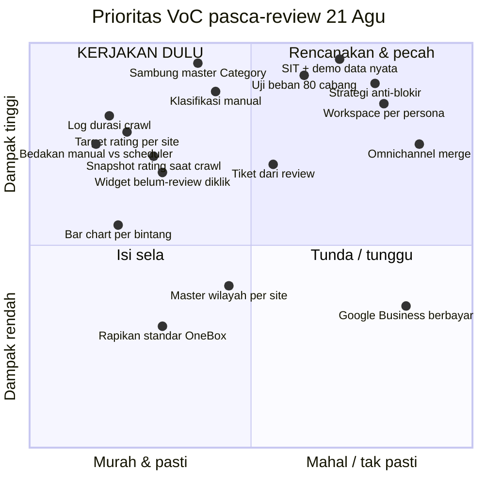

# Notulen: VoC Progress Review — 2026-08-21

> [!warning] Kelengkapan transkrip
> Transkrip **terpotong di menit ke-30** — batas akun gratis TurboScribe
> ("File ini lebih panjang dari 30 menit"). Dokumen ini menutupi **0:00–29:29**.
> Kalau rekaman aslinya lebih panjang, bagian sesudah menit 30 **belum tercatat
> di mana pun** dan perlu ditranskrip ulang sebelum dianggap lengkap.

**Format sesi:** demo progres VoC di `dev feature/voc`, dibedah langsung oleh
pimpinan/konsultan. Nadanya bukan status report — ini **review kebutuhan**, dan
sebagian besar sesi dipakai untuk membongkar asumsi produk, bukan bug.

---

## Ringkasan eksekutif

Yang ditagih di sesi ini **bukan fitur tambahan, melainkan alasan fiturnya ada.**
Pesan utamanya diulang tiga kali dengan kalimat berbeda: *"Lu harus kenal betul
siapa usernya, buat siapa screen ini."*

Tiga hal besar yang muncul:

1. **Satu layar dipakai untuk tiga persona yang kebutuhannya berbeda.** Humas/PR,
   kepala cabang, dan manajer wilayah dituntut memakai dashboard yang sama.
   Menurut sesi ini itu salah sejak desain, bukan kurang polesan.
2. **Klasifikasi kategori — bukan sentimen — adalah inti produk.** Positif/negatif
   tidak menjawab "harus memperbaiki apa". Yang menjawab: kebersihan, rasa,
   layanan, parkir. Tanpa itu, seluruh rantai (analisa → tiket → briefing) tidak
   punya bahan.
3. **Nilai rating hanya bermakna kalau ada pembanding.** Ditetapkan **tiga
   benchmark**: target internal, kompetitor, dan periode sebelumnya. 4,4 bisa
   "bagus" atau "jelek" tergantung ketiganya.

Prioritas eksplisit untuk sprint berikutnya: **test ranging (uji beban engine)**
dan **SIT — System Integration Test end-to-end, bukan partial**, dipresentasikan
dengan **kasus dan data nyata**, bukan mock.

---

## Keputusan

- **Target rating disetel per company/site**, bukan konstanta global. Nilai di
  bawah target ditandai merah. (Contoh: Hermina 4,5 → 4,4 jadi merah)
- **Benchmark ada tiga lapis** dan ketiganya wajib: (1) target sendiri,
  (2) kompetitor, (3) periode sebelumnya.
- **Semua bar chart dipecah per bintang 1–5**, bukan positif/negatif — berlaku
  untuk bar vertikal maupun horizontal.
- **Master data wilayah dimiliki site, bukan global.** Default boleh enumerasi
  provinsi, tetapi tiap site harus bisa mendefinisikan sendiri (Indonesia
  Barat/Tengah/Timur, atau Sumatra/Jawa).
- **Rating platform di-snapshot saat crawl**, tidak dihitung ulang sendiri —
  angka hasil hitungan sendiri akan berbeda dari rating resmi Google.
- **Status message open/close** masuk ke daftar review. Definisi close berbeda
  menurut kepemilikan akun:
  - akun **official** → close bila sudah diklasifikasikan **dan** sudah dibalas
  - akun **non-official** → close bila sudah diklasifikasikan saja
- **Review yang sudah diklasifikasi bisa menerbitkan tiket** ke unit terkait
  (mis. keluhan parkir → bagian umum/GA).
- **Urutan kerja:** minggu ini selesaikan Google Review; minggu depan gabungkan
  dengan Omnichannel — VoC bukan hanya Google Review.
- **Prioritas berikutnya: test ranging + SIT**, dipresentasikan dengan data nyata
  satu minggu.

---

## Raw insight

Dikelompokkan per tema, dengan timestamp supaya bisa dilacak balik ke rekaman.
Kutipan dipertahankan apa adanya.

### A. Target rating & benchmark `0:00–0:32` `25:28–26:32`

- *"Berapa rating minimum yang ditargetkan? Kalau misalkan Hermina, misalkan 4,5.
  Jadi yang 4,4 itu merah semuanya."*
- Setnya **by company/site**.
- *"Nah sih bos kadang-kadang kita 4,2 jelek gak? Kalau kompetitor lo 3,5?"* —
  Bunda 3,5 · Eka Hospital 3,2 · kita 4,5 → *"paling tinggi dong"*.
- Tiga benchmark, dieja langsung:
  1. berapa target dia — **benchmark pertama**
  2. berapa kompetitor — **benchmark kedua**
  3. berapa bulan lalu — **benchmark ketiga**
- *"Sekarang 4,4 bagus gak? Jelek! Soalnya bulan lalu masih 4,7 terus turun 4,6
  sekarang 4,4."*
- Contoh rantai analisa yang diharapkan: rating turun → *"pas liburan orang masuk
  banyak"* → omzet naik, dapur berantakan → **why?** → kompor rusak, orang kurang
  → tindakan: cadangan kompor, tambah orang.

### B. Klasifikasi & kategori `1:28–2:56` `4:12–4:36`

- Sentimen positif/negatif **sudah jadi**. Yang diminta: **tagging masalah**.
- *"Masalah apa itu pake AI pak."* — AI untuk tagging otomatis.
- Manual harus tetap bisa: *"Bukan, manualnya diisi."*
- Sempat memakai **mock data kategori**, padahal **kategori sudah ada di master**
  menurut Pak Agung — tinggal disambungkan.
- Alur: *"Ambil, simpan. Orang itu nanti klasifikasikan. Baru informasinya utuh."*
- Harus terlihat **mana yang belum diklasifikasikan**.
- Kegunaannya konkret: *"gue bisa analisa kebersihan itu sepanjang tahun ini
  yang ngomongin masalah kebersihan, berapa banyak. Yang ngomongin masalah rasa,
  berapa banyak. Itu Januari, Februari."*

### C. Persona & use case — kritik terbesar sesi ini `6:16–10:35`

> [!important] Kalimat kunci
> *"Ini ngomongin UI UX. Kita harus tahu dulu, siapa sih pengguna ini? Ini use
> case. Lu harus kenal betul siapa usernya, buat siapa screen ini."*

Tiga persona dengan kebutuhan yang **berbeda layar**, bukan berbeda filter:

| Persona | Siapa | Butuh apa |
|---|---|---|
| **Humas / PR / Contact Center** | pelaksana harian | monitor review, klasifikasi, balas, recap kalau diminta bos |
| **Kepala cabang / Store Manager / Kepala RS** | pemilik satu lokasi | **workspace**: recap + list review terbaru + drill-down bintang 1; *"nggak perlu ngeliatin review-review yang detail"* |
| **Manajer wilayah / "orang molding"** | pembina banyak cabang | banding antar cabang, siapa di bawah standar, masalah umumnya apa |

- *"Kalau by default role... ada pimpinan pusat, ada staff di Rumas"* — role sudah
  ada, tapi **screen-nya belum dibedakan**.
- Untuk manajer wilayah: *"Gue gak terlalu peduli yang udah di atas rata-rata.
  Yang gue perhatikan adalah siapa yang di bawah rata-rata yang harus gue
  molding. Dan masalahnya apa?"*
- Layar banding cabang disebut **untuk management briefing dan evaluasi**.

### D. Workspace & drill-down `5:54–7:55`

- *"Lu bisa klik yang bintang 1 apa aja? Nggak bisa, Pak. Nah, itu nanti harus
  bisa di-klik."*
- *"Dashboard itu not just recap-recap"* — angka harus bisa ditembus ke daftar.
- Trend harus bisa **difilter per kategori**: *"gue mau filter kebersihan,
  gimana caranya? Kebersihan itu membaik atau menurun."*

### E. Visualisasi `4:37–5:03`

- Bar dipecah **per bintang 1–5**, bukan positif/negatif.
- *"Untuk semua bar chart dan semua bar chart vertikal dan horizontal."*

### F. Alur end-to-end → tiket `10:35–11:42` `13:14–14:22`

- Setelah dapat informasi, **secara sistem**: *"Gue bikin task."* → **tiket**.
- *"Kalau misalkan gue ada konsisten masalah soto, soto, soto. Atau di rumah
  sakit misalkan masalah layanan satpam. Atau layanan parkir. Gue bikin tiket
  tuh. Ke siapa? Ke bagian GE. Ke bagian umum."*
- Status message **open/close**; open = belum di-response, belum di-review,
  belum diklasifikasikan.
- Widget wajib: **berapa belum di-review**, **berapa belum diklasifikasi** — dan
  **bisa diklik**.

### G. Master data wilayah `11:43–12:53`

- Default: enumerasi provinsi.
- *"Pastikan wilayah itu domainnya customizable untuk setiap site."*
- Alasan: *"Setiap company beda-beda."*

### H. Snapshot rating saat crawl `14:51–16:03`

- *"Pada saat dia itu ratingnya disimpan apa nggak? 17 Agustus, pada saat ini
  diambil, ketangkep nggak ratingnya pada saat itu?"*
- Bahayanya kalau dihitung ulang sendiri: *"4,4 itu sejak dia berdiri sampai
  sekarang. Tapi hitungan lo ini kan bisa rata-rata yang ada disini."*

### I. Engine, scheduler, dan uji beban `16:18–23:05`

- Scheduler sudah jalan sejak **Jumat**, weekdays, 2–3× sehari (jam 6 pagi &
  8 malam disebut).
- **Masalah yang diakui:** hasil manual dan terjadwal **tercampur** —
  *"gue lupa yang mana yang berdasarkan manual dan mana yang dari scheduler."*
- **Scheduler tidak boleh set satu-satu:** *"Kalo cabangnya ada 40 kan gua
  setting satu-satu... Pilih semuanya gitu langsung"* — juga per wilayah.
- **Log crawl wajib lengkap:** *"Sekali ngambil itu jam berapa. Terus startnya
  berapa. Endnya berapa. Berapa lama?"* → *"Jadi lo bisa tau engine itu jalan
  berapa lama."*
- **Skala yang dibayangkan:** Hermina ~80 cabang × 3× sehari = **240 crawl/hari**.
  Ke depan: kopi kenangan, dan **SPBU Pertamina** — *"Pertamina kan duit gede.
  Dia bisa beneran scrolling semua Pertamina."*
- **Risiko diblokir Google:** *"Pertanyaan gue ke blok kenapa? Apakah ini pake
  akun yang sama? Dari Chrome yang sama? Atau lo mau sebarin di Chrome? Atau di
  Docker?"*
- *"Tes engine itu minggu ini harus dapetin hasilnya."*
- Beban yang sudah dicoba baru **20–50**.

### J. Trend — dimensinya belum ditetapkan `23:11–25:08`

- *"Ketika ngomongin trend itu apanya? Yang mau diliat trend apanya?"*
- Kandidat dimensi: **traffic keseluruhan**, **per bintang**, **per kategori**.
- Belum diputuskan — masih pertanyaan terbuka.

### K. Google Business reply — terbatas & berbayar `0:44–1:24`

- Implementasi Google Business **sudah ada**, sedang dicoba bareng **Bang Sam**.
- Batasnya: *"Perlu berbayar untuk balas lebih dari 5."*
- *"Kalau mau daftarin suatu software, nganteri kontak dari Google-nya."*

### L. Notifikasi & forward `2:57–3:38`

- Kasus Five Coffee: review masuk harus bisa cepat diteruskan supaya bisa
  ditindak saat orangnya **masih di lokasi**.
- Tapi urutannya jelas: *"Tapi fungsikan dulu tuh. Harus bisa simpan dulu tuh
  klasifikasinya."*

### M. Rating diambil bukan berdasarkan jumlah rating tapi prioritaskan SEMUA rating dari tanggal yang dipilih
- Pada saat ini sitem fetch review masi berpacu pada jumlah rating yang akan diambil.  Misal worklist meminta 20 rating dengan filter tanggal 20 hari lalu -> rating yang diambil hanya 20 berdasarkan 20 hari lalu , walau rating sebenrnya ada 50 yang diambil tetap 50. Ini ada cacat FUNGSI bukan LOGIC
- Fungsi yang diharapkan : cursor dapat melihat tanggal terakhir rating diambil -> cursor melanjutkan scrape review jikalau semua review pada tanggal yang ada di worklist (filter) belum terambil. Tapi untuk scheduler masi tidak apa cantumkan jumlah ulasan.

### M. Arahan penutup `27:14–29:19`

Diulang eksplisit oleh Pak sebagai "action":

1. **Pahami kebutuhan** → mapping value & benefit aplikasi → **desainkan**
2. **Testing dari awal flow**: setting → ambil → performance (sehari 3× dengan
   objek banyak) → klasifikasi
3. **SIT — system integration test**, *"bukan partial test. Lo tes dari awal
   sampe end"*
4. **Presentasi dengan kasus & data nyata**: ambil data satu minggu, klasifikasi,
   tunjukkan masalah Hermina yang sebenarnya
5. Minggu ini Google Review → minggu depan gabung **Omnichannel**

---

## Action item

### Blok 1 — Fondasi data (tanpa ini, sisanya tidak punya bahan)

- [ ] Sambungkan klasifikasi kategori ke **master Category** yang sudah ada, lepas mock data — @sayyid — koordinasi dengan @pak-agung
- [ ] Sediakan **klasifikasi manual** (edit kategori per review) di samping tagging AI — @sayyid
- [ ] Tampilkan **"belum diklasifikasi"** sebagai status yang bisa disaring dan dihitung — @sayyid
- [ ] Simpan **snapshot rating platform** pada saat crawl, jangan dihitung ulang — @sayyid
- [ ] Setelan **target rating per site**, dipakai sebagai ambang pewarnaan merah — @sayyid

### Blok 2 — Engine & pembuktian beban (diminta selesai "minggu ini")

- [ ] **Log crawl lengkap**: waktu mulai, waktu selesai, durasi, jumlah diambil — @sayyid
- [ ] **Bedakan sumber batch**: manual vs scheduler, terlihat di Riwayat Fetch — @sayyid
- [ ] **Uji beban** ~80 cabang × 3×/hari; catat hasil dan titik gagalnya — @sayyid — minggu ini
- [ ] Tetapkan **strategi anti-blokir**: satu akun vs banyak, satu Chrome vs sebar container — @sayyid + @bang-sam
- [ ] Pastikan scheduler bisa pilih **banyak cabang / per wilayah sekaligus** — @sayyid

### Blok 3 — Persona & workspace

- [ ] Petakan **3 persona → 3 layar**: Humas, Kepala Cabang, Manajer Wilayah — @sayyid
- [ ] **Workspace kepala cabang**: recap + review terbaru + drill-down bintang — @sayyid
- [ ] **Layar banding antar cabang** untuk manajer wilayah: sorot yang di bawah standar + masalah umumnya — @sayyid
- [ ] Semua angka dashboard **bisa diklik** menuju daftar yang mendasarinya — @sayyid
- [ ] **Filter kategori pada trend** (kebersihan membaik/menurun) — @sayyid

### Blok 4 — Alur kerja & tiket

- [ ] Status **open/close** di daftar review, dengan aturan official vs non-official — @sayyid
- [ ] Widget **"belum di-review"** dan **"belum diklasifikasi"**, keduanya bisa diklik — @sayyid
- [ ] **Terbitkan tiket** dari review terklasifikasi ke unit terkait — @sayyid

### Blok 5 — Visual & master data

- [ ] Bar chart dipecah **per bintang 1–5** di seluruh grafik (vertikal & horizontal) — @sayyid
- [ ] **Master data wilayah per site**, bisa didefinisikan sendiri — @sayyid
- [ ] Rapikan tampilan mengikuti **standar OneBox** — @sayyid

### Blok 6 — Presentasi berikutnya

- [ ] Jalankan **SIT end-to-end**: setting → crawl → klasifikasi → tiket → close — @sayyid
- [ ] Siapkan **presentasi berbasis data nyata 1 minggu** Hermina: rating, masalah dominan, tindak lanjut — @sayyid
- [ ] Rencanakan penggabungan **Omnichannel** — @sayyid — minggu depan

### Blok 7 — Terhalang pihak luar

- [ ] Perjelas biaya & proses pendaftaran **Google Business API** untuk balas >5 — @bang-sam

---

## Priority matrix

Sumbu yang dipakai bukan "penting/mendesak" generik, melainkan yang benar-benar
menentukan di proyek ini:

- **Sumbu Y — Dampak pada keputusan:** seberapa besar item ini mengubah
  kemampuan tim meyakinkan klien/pimpinan bahwa produk ini bernilai.
- **Sumbu X — Biaya & risiko:** effort ditambah ketidakpastian teknis.

### Kuadran, dengan alasannya

> [!tip] Kerjakan dulu — dampak tinggi, biaya rendah
> **Log durasi crawl · Bedakan manual vs scheduler · Target rating per site ·
> Snapshot rating · Widget yang bisa diklik**
>
> Empat yang pertama semuanya **prasyarat pengukuran**. Tanpa log durasi, uji
> beban minggu ini tidak menghasilkan angka yang bisa dibaca. Tanpa pembeda
> sumber batch, hasil crawl tidak bisa dipercaya sebagai bukti. Tanpa target per
> site, warna merah tidak punya dasar. Semuanya kecil, dan semuanya memblokir
> pekerjaan yang jauh lebih besar — ini definisi paling murni dari prioritas satu.

> [!important] Rencanakan & pecah — dampak tinggi, biaya tinggi
> **Sambung master Category · Klasifikasi manual · Uji beban · Strategi
> anti-blokir · Workspace per persona · SIT + demo data nyata · Omnichannel**
>
> Ini isi sprint, bukan pekerjaan sela. Dua yang paling genting:
>
> - **Klasifikasi kategori** adalah simpul yang menahan hampir semua permintaan
>   lain. Trend per kategori, tiket ke unit, briefing manajemen, analisa
>   "kebersihan naik/turun" — semuanya bercabang dari satu kemampuan ini. Kalau
>   hanya satu hal yang bisa dikerjakan minggu ini, ini pilihannya.
> - **Strategi anti-blokir** adalah satu-satunya item dengan **risiko eksistensial**.
>   Kalau Google memblokir, bukan satu fitur yang gagal — seluruh produk berhenti.
>   Beban yang sudah teruji baru 20–50; targetnya 240/hari untuk Hermina saja,
>   dan skenario Pertamina jauh di atas itu. Ketidaktahuannya besar, jadi harus
>   dijawab lebih awal dari yang terasa nyaman.

> [!note] Isi sela — dampak rendah, biaya rendah
> **Rapikan standar OneBox · Master wilayah per site**
>
> Nyata dan diminta, tapi tidak memblokir siapa pun. Kerjakan saat menunggu
> hasil crawl atau saat butuh selingan dari pekerjaan berat.

> [!caution] Tunda / tunggu — terhalang di luar kendali tim
> **Google Business reply berbayar**
>
> Bukan soal effort, melainkan **dependensi eksternal**: biaya, antrean kontak
> Google, dan proses pendaftaran software. Yang bisa dikerjakan sekarang hanyalah
> memperjelas biaya dan syaratnya, supaya keputusannya bisa diambil pimpinan —
> bukan menunggu sambil diam.

### Urutan eksekusi yang gua sarankan

Ini bukan urutan kepentingan, melainkan urutan **ketergantungan** — tiap tahap
membuka tahap berikutnya:

1. **Instrumentasi dulu** (log durasi, pembeda sumber batch). Sehari. Tanpa ini
   tahap 2 tidak menghasilkan bukti.
2. **Uji beban + anti-blokir.** Jawab risiko terbesar selagi masih murah untuk
   berubah arah.
3. **Klasifikasi kategori end-to-end.** Simpul yang membuka trend, tiket, dan
   briefing.
4. **Persona & workspace.** Baru bermakna sesudah kategorinya ada — workspace
   tanpa kategori cuma recap yang dipindah tempat.
5. **SIT + demo data nyata.** Ini panen, bukan tanam. Butuh 1–4 sudah berdiri.
6. **Omnichannel.** Perluasan sumber, sesudah satu sumber terbukti utuh.

> [!danger] Risiko urutan yang perlu diwaspadai
> Permintaan di sesi ini didominasi hal yang **terlihat** (workspace, chart,
> drill-down), sementara yang **memblokir** justru tidak terlihat (log,
> klasifikasi, ketahanan engine). Godaan alaminya adalah mengerjakan yang
> terlihat lebih dulu karena lebih mudah didemokan. Kalau itu terjadi, demo
> berikutnya akan tampak lebih bagus tetapi **tetap tidak bisa menjawab
> "masalah Hermina apa"** — dan justru itu yang diminta.

---

## Follow-up / pertanyaan terbuka

- [ ] **Dimensi trend belum diputuskan.** Traffic keseluruhan, per bintang, atau
      per kategori? Pak sendiri menyebut ketiganya tanpa memilih. → perlu ditanya
      balik sebelum dibangun.
- [ ] **Definisi "close" untuk akun non-official** — cukup diklasifikasi. Perlu
      dipastikan ini final, karena berpengaruh ke angka widget.
- [ ] **Siapa penerima tiket** per kategori? Contoh yang disebut baru "bagian
      umum/GA" untuk parkir. Pemetaan kategori → unit belum ada.
- [ ] **Berapa target rating tiap site** — angka 4,5 untuk Hermina baru contoh
      dalam pembicaraan, bukan angka resmi.
- [ ] **Bagaimana perlakuan kompetitor dalam benchmark** — apakah rata-rata semua
      kompetitor, atau dibanding satu per satu?
- [ ] **Status Google Business API**: biaya pasti, dan apakah antrean pendaftaran
      sudah dimulai. → @bang-sam
- [ ] **Transkrip menit ke-30 dan sesudahnya belum ada.**

---

## Catatan: sebagian permintaan mungkin sudah tertutup

Notulen ini bertanggal **21 Agustus**; per **25 Agustus** ada pekerjaan yang sudah
masuk `feature/voc`. Daftar di bawah **perlu diverifikasi ulang sebelum dilaporkan
sebagai selesai** — sebagiannya menutup sebagian saja, dan mengklaim selesai
terlalu cepat justru merusak kepercayaan di demo berikutnya.

| Permintaan sesi | Kemungkinan sudah ada | Perlu dicek |
|---|---|---|
| Scheduler pilih banyak cabang | Pemilih cabang dengan pencarian + multi-pilih | Apakah bisa **per wilayah**, bukan cuma multi-pilih manual |
| Tiket dari review | `reviewEscalate` + klasifikasi otomatis | Pemetaan **kategori → unit penerima** |
| Klasifikasi manual | Koreksi kategori & urgensi tersimpan di Meta | Apakah muncul sebagai **status "belum diklasifikasi"** yang bisa disaring |
| Riwayat fetch | Batch, cabang, status, jumlah, waktu | **Durasi** dan **pembeda manual/scheduler** |
| Role & screen berbeda | RBAC per menu sudah jalan (4 role dibedakan) | Ini membatasi **akses**, belum membuat **layar berbeda per persona** |
| Benchmark kompetitor | Master data & analisa kompetitor ada | Apakah sudah dipakai sebagai **benchmark kedua** di dashboard |

---

## Tautan

- [[VOC_CREDENTIALS]] — akun uji & kredensial
- [[VOC_CRAWLER_SERVICE_CONFIG]] — konfigurasi sisi Crawler, batas multi-tenant
- [[VOC_SITE_B_TENANT_KEDUA]] — tenant kedua untuk uji isolasi
- [[MULTITENANCY_VOC_PEMAHAMAN]] — model multi-tenant VoC
- [[EPIC_BACKLOG]] — backlog epik VoC
