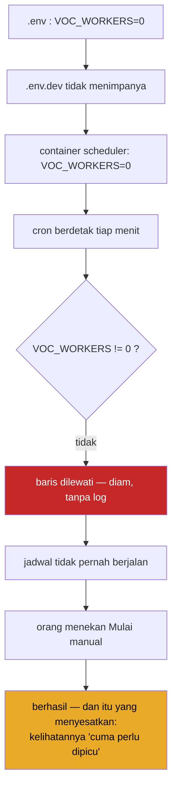

# VoC Scheduler — kenapa masih harus di-trigger manual

## Jawaban singkat

**Bukan karena IP server private, dan bukan karena kamu tidak di kantor.**

Scheduler berjalan sebagai **cron di dalam container di server**. Ia tidak
memanggil apa pun dari mesinmu, tidak lewat browser, dan tidak peduli kamu di
kantor atau tidak. Kalau server hidup, ia jalan; kalau kamu tidur, ia tetap
jalan.

Sebab sebenarnya satu baris konfigurasi:

> **`.env.dev` tidak mendefinisikan `VOC_WORKERS`**, sehingga nilainya jatuh ke
> `0` dari `.env`, dan baris cron VoC dilewati setiap menit tanpa pesan apa pun.

---

## Hipotesis "IP private" — diuji, ditolak

| Klaim | Hasil |
|---|---|
| Scheduler butuh dipicu dari mesin saya | **Salah.** Ia cron di dalam container server |
| Server dev tidak bisa menjangkau Crawler `192.168.1.3` | **Salah.** Terbukti bisa |

**Buktinya:** pada 24 Agustus, penarikan manual dari layar Fetch Jobs **di dev**
berhasil — batch `c219470b`, 10 ulasan tersimpan, muncul di OneBox dev pada
lokasi 682. Penarikan itu dijalankan **server-to-server** dari backend dev ke
`192.168.1.3:8000`.

Kalau IP private memblokir, batch itu tidak akan pernah selesai. Jadi rute
jaringan dev → Crawler **sudah terbuka**.

> [!note] Hipotesisnya tidak asal — cuma salah tempat
> IP private memang bisa jadi masalah nyata di integrasi ini (lihat
> [[NETWORK_WIREGUARD_CORS_ONEBOX]]). Tetapi gejalanya berbeda: **timeout,
> connection refused, no route to host** — bukan "diam saja". Scheduler yang
> terhalang jaringan akan meninggalkan jejak kegagalan. Yang terjadi sekarang
> adalah **tidak ada jejak sama sekali**, dan itu menunjuk ke arah lain: ia tidak
> pernah dijalankan.

---

## Sebab sebenarnya, rantai lengkapnya

### 1. Baris cron-nya bersyarat

`onecloud/crontab.txt`:

```bash
* * * * * [ -f /container.env ] && . /container.env; \
          [ "${VOC_WORKERS:-0}" != "0" ] && ./runx voc schedule
```

Kalau `VOC_WORKERS` kosong atau `0`, perintahnya **tidak dijalankan** — dan
karena ini kondisi shell biasa, tidak ada log, tidak ada error, tidak ada apa
pun. Cron tetap berdetak tiap menit; yang tidak terjadi hanyalah bagian setelah
`&&`.

### 2. Nilai `VOC_WORKERS` di dev jatuh ke 0

`path.sh` memuat env berlapis, yang terakhir menang:

```bash
source .env                                   # VOC_WORKERS=0
source ./.env.$ONECLOUD_BRANCHROOT            # (bila ada)
source .env.$1                                # .env.dev
```

Dan inilah isinya:

| Berkas | `SCHEDULER_REPLICAS` | `VOC_WORKERS` |
|---|---|---|
| `.env` (dasar) | 1 | **0** |
| **`.env.dev`** ← dipakai dev | **1** | **tidak didefinisikan** |
| `.env.development` | **0** | 1 |
| `.env.local` | 0 | tidak didefinisikan |

`.env.dev` menyalakan container scheduler (`SCHEDULER_REPLICAS=1`) tetapi
**tidak pernah menyebut `VOC_WORKERS`**. Jadi nilainya tetap `0` warisan dari
`.env`, dan baris VoC dilewati.

> [!warning] `.env.development` menyesatkan, dan bukan berkas yang dipakai dev
> Isinya `VOC_WORKERS=1` — terlihat benar — tetapi dipasangkan dengan
> `SCHEDULER_REPLICAS=0`, yang berarti **container scheduler-nya tidak pernah
> dideploy**. Kombinasi itu saling meniadakan: izinnya menyala, tetapi tidak ada
> yang membacanya.
>
> Lebih penting lagi: **dev memakai `.env.dev`, bukan `.env.development`.** Nama
> stack-nya `dev_<branch>` berasal dari `${ONECLOUD_ENV}_${ONECLOUD_SUFFIX}`
> dengan `ONECLOUD_ENV=dev`. Mengedit `.env.development` tidak akan mengubah apa
> pun di dev.

### 3. Rantai kegagalannya



Kenapa ini sulit dilihat: **penarikan manual berhasil**. Jadi semua yang dicurigai
— jaringan, token, kuota, Crawler — terbukti sehat satu per satu. Yang rusak
justru bagian yang tidak menghasilkan gejala apa-apa.

---

## Perbaikan

### Yang disarankan: tambahkan satu baris ke `.env.dev`

```bash
# .env.dev
VOC_WORKERS=1
```

Itu saja. `SCHEDULER_REPLICAS` di sana sudah `1`, jadi container-nya memang
berjalan — tinggal izinnya dinyalakan.

Sesudah itu **stack scheduler perlu dideploy ulang** supaya nilai barunya masuk:
env dibaca saat container dibuat, bukan saat cron berdetak.

### Kenapa bukan mengubah `.env`

`.env` adalah nilai dasar untuk **semua** environment, termasuk produksi.
Mengubahnya jadi `1` menyalakan scheduler VoC di tempat-tempat yang belum siap
menerimanya. Nilai `0` di sana memang disengaja: **aktif per-environment, bukan
global.**

### Kenapa bukan memperbaiki `.env.development`

Karena dev tidak memakainya. Berkas itu tetap layak dirapikan — kombinasi
`SCHEDULER_REPLICAS=0` + `VOC_WORKERS=1` menyesatkan siapa pun yang membacanya —
tetapi merapikannya **tidak akan menyalakan scheduler di dev**.

---

## Cara memverifikasi setelah perbaikan

Urut dari yang paling dekat ke akar. Berhenti di langkah pertama yang gagal.

**1. Container scheduler benar-benar ada**

```bash
docker service ls | grep scheduler
# REPLICAS harus 1/1, bukan 0/0
```

`0/0` berarti `SCHEDULER_REPLICAS=0` — cron-nya tidak ada sama sekali.

**2. Nilai env di dalam container**

```bash
CID=$(docker ps -q -f name=scheduler | head -1)
docker exec "$CID" bash -lc 'grep VOC_WORKERS /container.env'
# harus VOC_WORKERS="1"
```

`/container.env` dibuat saat container start (`declare -px > /var/www/html/container.env`).
Kalau isinya masih `0`, container-nya belum dideploy ulang.

**3. Crontab benar-benar terpasang**

```bash
docker exec "$CID" bash -lc 'crontab -u www-data -l | grep voc'
```

**4. Barisnya benar-benar dieksekusi**

```bash
docker exec "$CID" bash -lc 'ls -la /tmp/onecloud_*voc_schedule*.log; tail -20 /tmp/onecloud_*voc_schedule*.log'
```

`runx` mengarahkan keluaran ke `/tmp/onecloud_${ONECLOUD_NAME}_${ONECLOUD_SERVICE}-cron-*.log`.
**Berkas log yang tidak pernah dibuat** adalah bukti paling kuat bahwa barisnya
dilewati, bukan gagal.

**5. Jadwalnya benar-benar menghasilkan batch**

Buka Riwayat Fetch. Setelah instrumentasi sumber batch terpasang, batch
terjadwal akan bertanda **Terjadwal**, bukan Manual. Sebelum itu, cocokkan
waktunya dengan jam jadwal yang disetel.

---

## Kapan IP private BENAR-BENAR jadi masalah

Supaya tidak salah arah lain kali. Gejalanya berbeda dan bisa dibedakan:

| Gejala | Artinya | Bukan ini |
|---|---|---|
| Tidak ada log sama sekali, tidak ada batch | Cron dilewati — `VOC_WORKERS=0` | bukan jaringan |
| `timeout`, `connection refused`, `no route to host` | Rute/firewall ke Crawler | bukan konfigurasi cron |
| `401` / `403` dari Crawler | Token atau scope | bukan jaringan |
| `TENANT MISMATCH` | `company_id` tidak cocok dengan token | bukan jaringan |
| Batch jalan tapi 0 ulasan | Selenium/Chrome di host Crawler | bukan OneBox |

**Uji rute dari dalam container**, bukan dari laptop — yang menentukan adalah
jalur server, bukan jalur kamu:

```bash
CID=$(docker ps -q -f name=scheduler | head -1)
docker exec "$CID" bash -lc 'curl -s --max-time 8 http://192.168.1.3:8000/api/health'
# {"status":"ok",...} berarti rutenya terbuka
```

Kalau perintah itu berhasil dari container tetapi gagal dari laptopmu, itu
**normal** — dan sama sekali tidak memengaruhi scheduler.

---

## Catatan: jejak masalah ini sebelumnya

Ini kambuh kedua kalinya, dengan wajah berbeda:

1. **Pertama** — `VOC_SCHEDULER` tidak diloloskan whitelist `environment:` di
   `docker-compose.yml`, jadi nilainya tidak pernah sampai ke container. Sudah
   diperbaiki dengan mendaftarkannya di dua compose.
2. **Sekarang** — variabelnya lolos, tetapi **nilainya tidak pernah disetel** di
   env yang dipakai dev.

Polanya sama: **saklar berlapis yang diam saat mati.** Compose harus meloloskan,
env harus menyetel, cron harus mengevaluasi — dan kegagalan di lapisan mana pun
menghasilkan gejala yang identik: tidak terjadi apa-apa.

Perbaikan yang lebih tahan lama: buat baris cron **berbicara saat dilewati**,
bukan diam. Satu `echo` ke log ketika `VOC_WORKERS=0` akan mengubah empat jam
penelusuran menjadi satu baris yang langsung terbaca:

```bash
* * * * * [ -f /container.env ] && . /container.env; \
          if [ "${VOC_WORKERS:-0}" != "0" ]; then ./runx voc schedule; \
          else echo "$(date) voc schedule dilewati: VOC_WORKERS=${VOC_WORKERS:-0}" \
               >> /tmp/voc_schedule_skip.log; fi
```

---

## Ringkasan tindakan

- [ ] Tambahkan `VOC_WORKERS=1` ke **`.env.dev`** — @sayyid
- [ ] Deploy ulang stack agar env baru terbaca container scheduler — @sayyid
- [ ] Verifikasi 5 langkah di atas, berhenti di kegagalan pertama — @sayyid
- [ ] Rapikan `.env.development` yang menyesatkan (`SCHEDULER_REPLICAS=0` + `VOC_WORKERS=1`) — @sayyid
- [ ] Pertimbangkan cron yang mencatat saat dilewati, supaya kambuh ketiga langsung terlihat — @sayyid

---

## Tautan

- [[NETWORK_WIREGUARD_CORS_ONEBOX]] — kapan jaringan benar-benar jadi sebab
- [[VOC_CRAWLER_SERVICE_CONFIG]] — token, tenant, dan endpoint Crawler
- [[2026-08-25-voc-grooming-sprint]] — instrumentasi crawl (`NEW01`) yang membuat batch terjadwal bisa dibedakan dari manual
